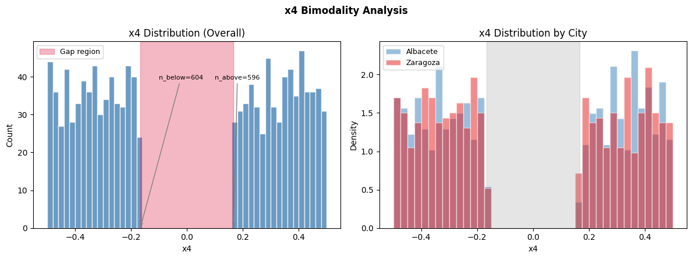
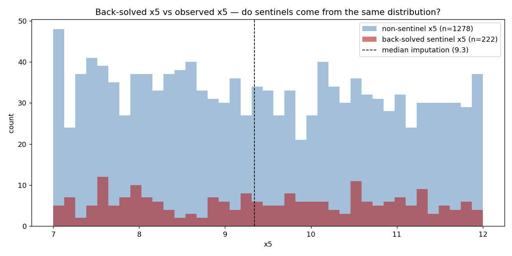
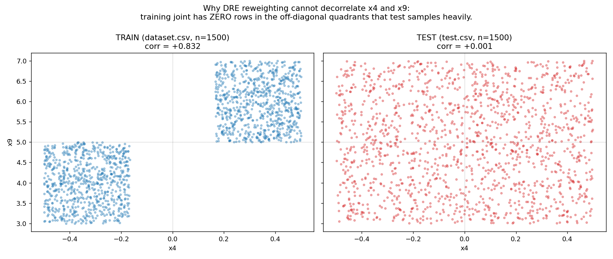
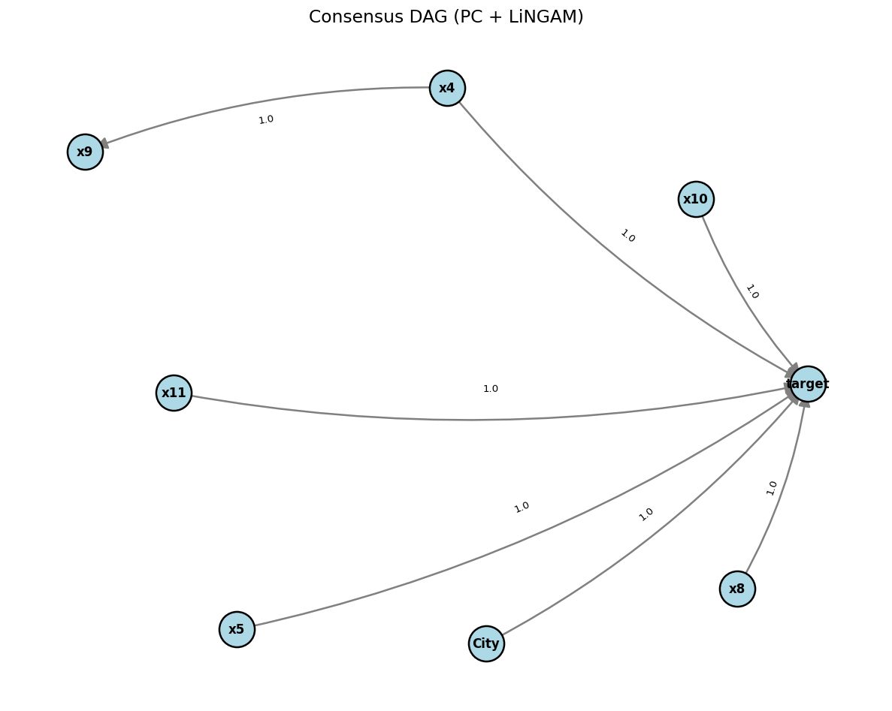
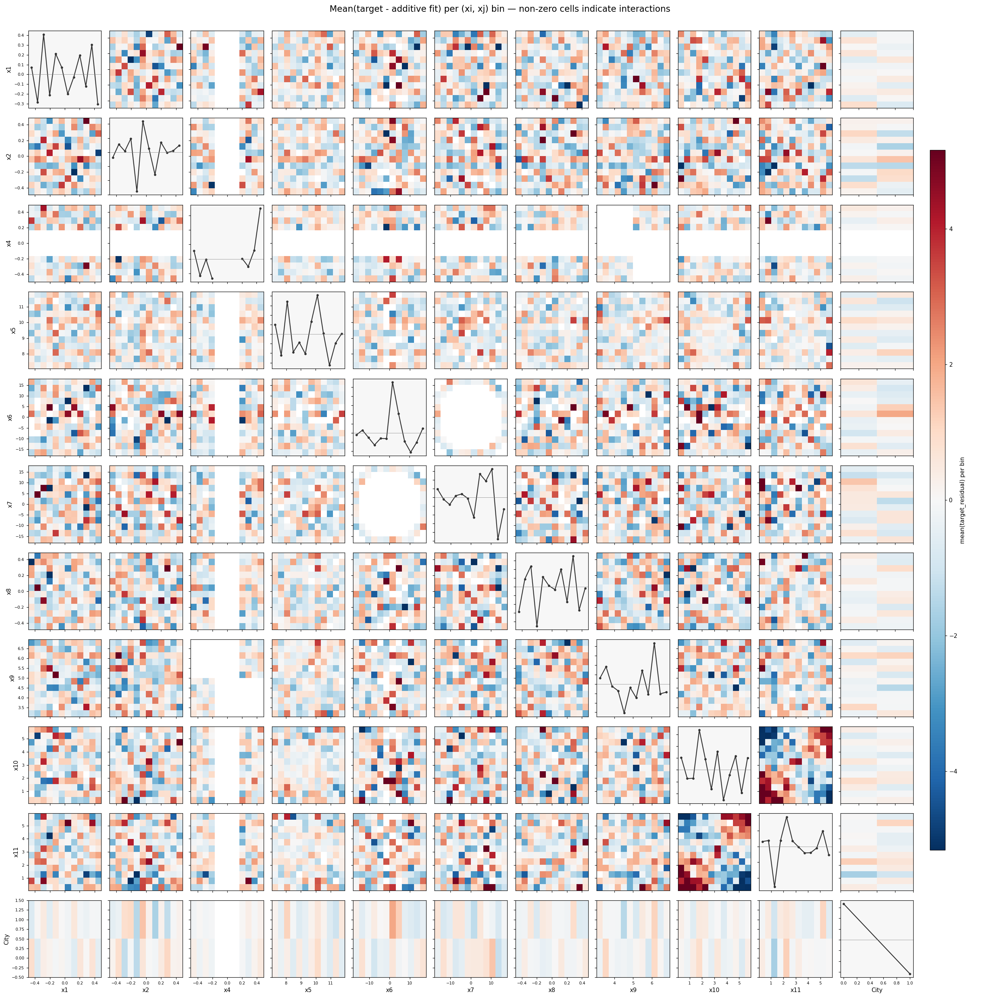
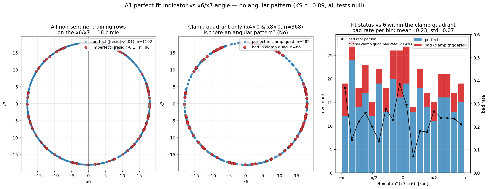

# The Perfect Fit — Work Report

Observation-only summary of the work done on the Kaggle Perfect Fit
competition. Each section reports what was done and what was seen, without
drawing conclusions or making recommendations.

## 1. Dataset

- 1500 rows in training (`dataset.csv`), 1500 rows in test (`test.csv`).
- Features: `x1, x2, Country, City, x4, x5, x6, x7, x8, x9, x10, x11`. Note
  the competition skips `x3`.
- Target: `target`, continuous, std ≈ 24.1.
- Evaluation metric: MAE.

## 2. Data structure observations

- `Country` is constant at `Spain` on every row (train and test).
- `City` is binary: `Zaragoza` / `Albacete`.
- `x5` has 222 training rows and 228 test rows exactly equal to `999.0`
  (sentinel). The remaining rows lie in `[7.0, 11.5]` and no value appears
  in `(11.5, 999)`.
- `x6² + x7² = 324` to numerical precision on every row; i.e. `(x6, x7)`
  lives on a circle of radius 18. The angle `θ = atan2(x7, x6)` is uniform
  on `[−π, π]`.
- `x4` is bimodal with a gap at `[−0.167, +0.167]`. Training has zero
  observations in this gap; the test set has 508 rows (33.9%) inside it.





## 3. Training vs test distribution observations

- `corr(x4, x9)` = +0.832 in training and +0.001 in test.
- The training joint of `(x4, x9)` forms two disjoint clusters:
  `x4>0 → x9 ∼ N(5.97, 0.57)` and `x4<0 → x9 ∼ N(4.02, 0.57)`.
  Within-cluster `corr(x4, x9) ≈ 0`.
- Test contains 734 rows (48.9%) in the off-diagonal quadrants
  `{x4>0, x9<5}` and `{x4<0, x9>5}`, which are empty in training.
- The x5 sentinel rate is preserved: 14.8% in training, 15.2% in test.
- All other pairwise feature correlations are < 0.06 in both sets.



## 4. EDA observations

- Marginal linear correlations with target (decreasing magnitude):
  City, x4, x5 (after sentinel handling), x8, x9, x10, x11.
- `x1` has no linear signal (r ≈ 0) but a hump-shape (GAM R² = 0.109).
- `x2` has no linear signal but oscillates (GAM R² = 0.068,
  cos(5π·x2) fit).
- `x6`, `x7` individually have no univariate signal; `θ` is independent
  of every other feature and of the sentinel indicator.
- PC and DirectLiNGAM consensus on training: a directed edge `x4 → x9` is
  detected.
- Full per-pair interaction search (double-centred residual grid on a
  12×12 bin) ranks `x10 × x11` at RMS 3.02; no other pair exceeds the
  noise floor of ~1.71 (the next-ranked pairs cluster at 1.5–1.7).
- `sqrt(x6² + x7²) − 18` has std 0 and `corr(θ, x5) = +0.012`.





## 5. Models trained

CV is 5-fold `KFold(shuffle=True, seed=42)` on `dataset.csv`. LB is the
Kaggle public leaderboard MAE.

| Family | Variant | CV MAE | LB MAE |
|---|---|---|---|
| Linear | baseline (City + x4 + x5 + x8 + x10 + x11) | 9.98 | — |
| Linear | + splines(x1, x2) + x10·x11 (no x9) | 3.70 | 7.38 |
| Linear | + x4 + x9 (raw) + x10·x11 | 3.48 | — |
| Linear | locked-integer A2-skeleton + x9_wc | 2.90 | 10.75 |
| GAM | baseline (pygam) | 4.40 | — |
| GAM | tuned + x10·x11 | 3.56 | — |
| GAM | + x9_wc (enhanced) | 3.00 | — |
| Closed-form | A1 (hand-engineered, step at x4 = 0) | 1.80 | 10.80 |
| Closed-form | A2 (ClosedFormModel, x9_resid) | 3.49 | 9.44 |
| LightGBM | default | 5.83 | — |
| LightGBM | tuned | 4.66 | — |
| EBM | default | 3.24 | — |
| EBM | R2 tuned (smoothing 2k, max_bins=128) | 3.11 | 5.66 |
| EBM | heavy smoothing (2k smooth + 1.5k refine) | 3.08 | 4.90 |
| EBM | all-smoothed (4k, 0 refine) | 3.03 | 4.90 |
| EBM | drop-x9 (heavy smoothed) | 3.83 | 7.57 |
| Ensemble | EBM + GAM 70/30 | 2.91 | 6.47 |
| Ensemble | NNLS stacking of EBM + GAM + A1 | 2.02 | — |
| Ensemble | cross_LE (0.5 · LIN_x4 + 0.5 · EBM_x9) | 2.97 | 2.94 |
| Ensemble | triple (0.25 LIN_x4 + 0.25 EBM_x9 + 0.5 EBM_full) | 2.82 | — |
| Routing | safe → A1, unsafe → triple | 1.84 | — |

Additional experiments (all CV-validated, not submitted):

- EBM with x4 forced linear via residualisation: CV 3.33–3.61 depending
  on β choice, vs 3.03 for unconstrained.
- EBM with monotone constraints on x4, x5, x8, City: CV 3.49.
- EBM with interactions = 0: CV 4.16.
- 20-seed EBM bag: CV 3.02 (solo 3.03).
- Per-cluster EBM (route by sign(x4)): CV 3.50.
- Density-ratio reweighting to break the x4-x9 correlation (classifier,
  KDE, Gaussian copula): weighted `corr(x4, x9)` dropped from 0.83 to
  0.81 (classifier), 0.80 (KDE), 0.74 (copula). CV moved ≤ 0.08 in
  any direction.
- Synthetic off-diagonal training rows (x9 permuted, target recomputed
  via A1): CV 4.40 for the triple ensemble on top of 2.82 baseline.
- A1 + EBM residual corrector: CV 2.04.

## 6. Closed-form A1 observations

Formula (from `scripts/compare_formulas.py`):

```
target = −100·x1² + 10·cos(5π·x2)
       + 15·x4 + 20·𝟙(x4 > 0)
       − 8·x5_imp + 15·x8 − 4·x9
       + x10·x11 − 25·𝟙(city = Zaragoza) + 92.5
```

Zero free parameters. Observations on `dataset.csv`:

- Training CV MAE 1.80 overall; non-sentinel MAE 0.376; sentinel MAE 9.996.
- 93.27% of non-sentinel rows have `|target − A1(x)| < 0.01` (1192 of 1278).
- The 6.67% imperfect rows (n = 86) all lie in the quadrant
  `x4 < 0 AND x8 < 0`. No imperfect rows outside that quadrant.
- Breakdown of A1 residual within quadrants (non-sent only):

  | Quadrant | n | Mean \|resid\| | % with \|resid\| > 0.1 |
  |---|---|---|---|
  | x4>0, x8>0 | 294 | 0.000 | 0% |
  | x4>0, x8<0 | 331 | 0.000 | 0% |
  | x4<0, x8>0 | 285 | 0.000 | 0% |
  | x4<0, x8<0 | 368 | 1.306 | 23.4% |

- On the 86 imperfect rows: residual / x8 has mean −18.41, std 0.76,
  range [−21.29, −17.18].

## 7. Clamp-trigger search

"Clamp" refers to the 23% of `x4<0 AND x8<0` rows where A1 is imperfect.
Tests run on the 368 quadrant rows with binary label `is_bad = |resid|>0.1`:

- Top pairwise product correlations with `is_bad`:
  `x5·x8` (−0.168), `x8·x9` (−0.164), `x4·x8` (+0.137),
  `x8·x11` (−0.115), `x5·x9` (−0.100), `x9·x10` (−0.088).
- Top pairwise difference correlations:
  `x4 − x8` (+0.192), `x1 − x8` (+0.108), `x4 − x9` (+0.102).
- Single-feature threshold rules (`x10 < 1.5`, `x10·x11 < 6`,
  `|x8| > |x4|`, `x9 < 4`, …) all return 22–26% bad rate regardless of
  cutoff.
- 4-level sklearn decision tree on all features: training accuracy 0.802
  vs trivial baseline 0.766.
- LightGBM classifier on all features + `{sin θ, cos θ, sin 2θ, cos 2θ}`:
  5-fold OOF accuracy 0.734, OOF AUC 0.763.
- KS test on θ distributions (bad vs perfect within the quadrant):
  D = 0.069, p = 0.89. Mann-Whitney U p = 0.93. `corr(θ, |resid|) = +0.014`.
  All 8 angular-region rules give 22–26% bad rate.
- Router variants using the LightGBM classifier (soft blend or hard
  threshold at 0.3/0.4/0.5/0.6) all produced CV 1.855–1.863, vs 1.839 for
  the base router that routes all "safe" rows to A1 regardless of clamp
  probability.



## 8. Final submission set

Seven submissions currently held in `submissions/`. CV on `dataset.csv`,
LB on the competition public leaderboard where tested.

| File | CV MAE | LB MAE |
|---|---|---|
| `submission_ebm.csv` | 3.11 | 5.66 |
| `submission_ebm_heavy_smooth.csv` | 3.08 | 4.90 |
| `submission_ensemble_cross_LE.csv` | 2.97 | 2.94 |
| `submission_ensemble_cross_LE_locked_c_50.csv` | 2.95 | — |
| `submission_ensemble_triple_locked_b_lambda30.csv` | 2.83 | — |
| `submission_ensemble_triple_locked_b_lambda50.csv` | 2.82 | — |
| `submission_router_A1_triple.csv` | 1.84 | — |

Public leaderboard top cluster at the time of writing sits at 1.65–1.71.
The theoretical noise floor from the x5 sentinel (assuming Uniform(7, 12)
imputation error) is 228 · 10 / 1500 = 1.52.
